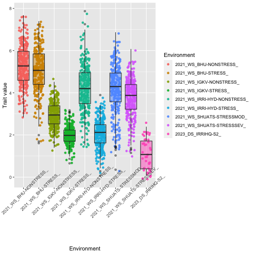

```
## NULL
```

### Distribution by environment

The following boxplot allows to see the distribution of predicted values (y-axis) in the different environments for each **trait**.

<p>&nbsp;</p>

<!--html_preserve--><div class="form-group shiny-input-container">
<label class="control-label" id="mtaApp_1-traitMta-label" for="mtaApp_1-traitMta"></label>
<div>
<select id="mtaApp_1-traitMta" class="shiny-input-select"><option value="Plant_Height_cm" selected>Plant_Height_cm</option>
<option value="Yield_Mg_ha">Yield_Mg_ha</option></select>
<script type="application/json" data-for="mtaApp_1-traitMta" data-nonempty="">{"plugins":["selectize-plugin-a11y"]}</script>
</div>
</div><!--/html_preserve-->



### Distribution across environment (please see downloaded report)


```
## NULL
```

NULL


<p>&nbsp;</p>

### Genetic correlations between environments

The following graph allows to see the genetic correlations of the different environment for each **trait**.

<p>&nbsp;</p>

<!--html_preserve--><div class="form-group shiny-input-container">
<label class="control-label" id="mtaApp_1-traitPredictionsCorrelation-label" for="mtaApp_1-traitPredictionsCorrelation"></label>
<div>
<select id="mtaApp_1-traitPredictionsCorrelation" class="shiny-input-select"><option value="Plant_Height_cm" selected>Plant_Height_cm</option>
<option value="Yield_Mg_ha">Yield_Mg_ha</option></select>
<script type="application/json" data-for="mtaApp_1-traitPredictionsCorrelation" data-nonempty="">{"plugins":["selectize-plugin-a11y"]}</script>
</div>
</div><!--/html_preserve-->


<!--html_preserve--><div class="plotly html-widget html-widget-output shiny-report-size shiny-report-theme html-fill-item" id="mtaApp_1-outc63af25df7e7df9c" style="width:100%;height:400px;"></div><!--/html_preserve-->

<p>&nbsp;</p>

## Genetic correlations between traits

The following graph allows to see the genetic correlations among traits using across environment estimates.

<p>&nbsp;</p>

<!--html_preserve--><div class="plotly html-widget html-widget-output shiny-report-size shiny-report-theme html-fill-item" id="mtaApp_1-out584cb1bb3238b06c" style="width:100%;height:400px;"></div><!--/html_preserve-->

<p>&nbsp;</p>

## Biplot by trait

The following graph allows to see the performance of the genotypes over the enevironments for each **trait**.

<p>&nbsp;</p>

<!--html_preserve--><div class="form-group shiny-input-container">
<label class="control-label" id="mtaApp_1-traitBiplot-label" for="mtaApp_1-traitBiplot"></label>
<div>
<select id="mtaApp_1-traitBiplot" class="shiny-input-select"><option value="Plant_Height_cm" selected>Plant_Height_cm</option>
<option value="Yield_Mg_ha">Yield_Mg_ha</option></select>
<script type="application/json" data-for="mtaApp_1-traitBiplot" data-nonempty="">{"plugins":["selectize-plugin-a11y"]}</script>
</div>
</div><!--/html_preserve-->

<!--html_preserve--><div class="plotly html-widget html-widget-output shiny-report-size shiny-report-theme html-fill-item" id="mtaApp_1-out8c267040401e53b5" style="width:100%;height:400px;"></div><!--/html_preserve-->


<p>&nbsp;</p>

### Predictions 

The following table allows to check the trait predictions in wide format together with the QTL profile in case those are available.

<p>&nbsp;</p>

<!--html_preserve--><div class="datatables html-widget html-widget-output shiny-report-size html-fill-item" id="mtaApp_1-out7463ee18a37b09df" style="width:100%;height:auto;"></div><!--/html_preserve-->


