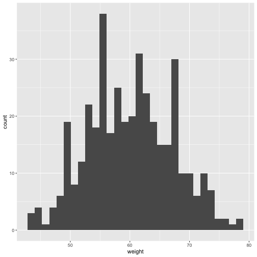

### Predicted genetic gain

The following density plot allows you to see the expected change in the next generation compared to the current generation given the current genetic gain parameters (accuracy, intensity, genetic variance) obtained in a particular MET for the selected traits.

&nbsp;

<!--html_preserve-->

<label class="control-label" id="pggApp_1-traitFilterPredictions2D2-label" for="pggApp_1-traitFilterPredictions2D2">Trait:</label>

<select id="pggApp_1-traitFilterPredictions2D2" class="shiny-input-select"><option value="YLD_TON" selected>YLD_TON</option>
<option value="HT_AVG">HT_AVG</option></select>

<!--/html_preserve-->

<!--html_preserve-->

<!--/html_preserve-->

## Phenotypic Correlation of STA BLUEs between trials  {.tabset .tabset-pills}    

  

### YLD_TON {.tabset .tabset-pills}       

### HT_AVG {.tabset .tabset-pills}       

