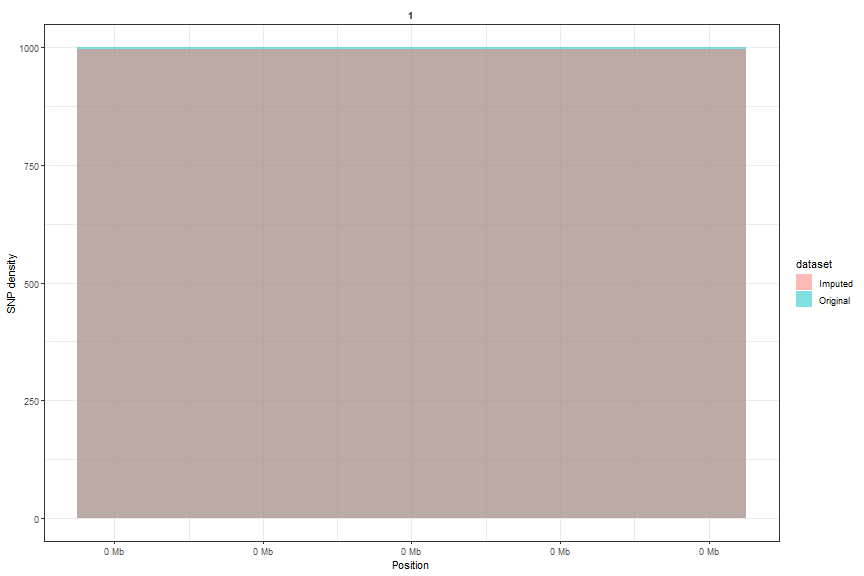

### Overall Summary

&nbsp;

This table presents a side-by-side comparison of our dataset before and after applying the selected filtering steps, highlighting changes in key metrics: number of loci, number of individuals, overall missingness, mean individual heterozygosity, and mean minor-allele frequency (MAF).

<!--html_preserve-->

<!--/html_preserve-->

### Variant distribution

<!--html_preserve-->

<!--/html_preserve-->

This plot shows the genomic positions of SNPs before (blue) and after (red) imputation, highlighting how the filtering process modify the distribution relative to the original dataset.

plot of chunk unnamed-chunk-4

### Table of modifications

&nbsp;

The following table shows the modifications that have been saved in your analysis object and that will be applied to the raw genotype data when this specific time stamp (ID) is selected/used in other analytical modules (e.g., multi trial analysis module).

<!--html_preserve-->

<!--/html_preserve-->

&nbsp;

### References on methods used

Tukey, J. W. (1977). Exploratory Data Analysis. Section 2C.

Velleman, P. F. and Hoaglin, D. C. (1981). Applications, Basics and Computing of Exploratory Data Analysis. Duxbury Press.

&nbsp;

