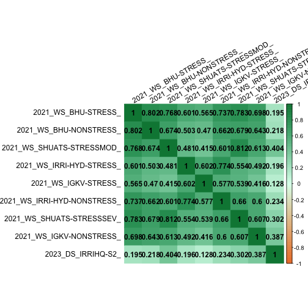
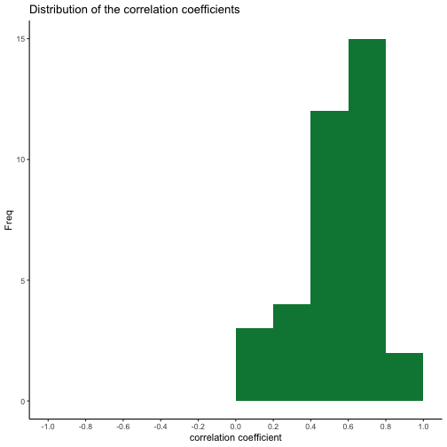
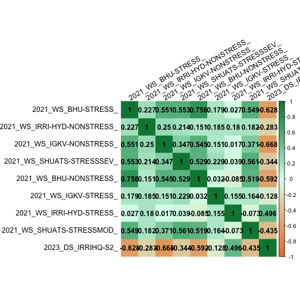
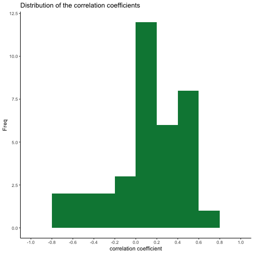
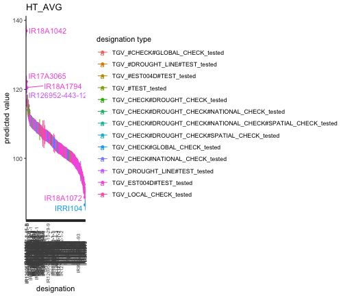
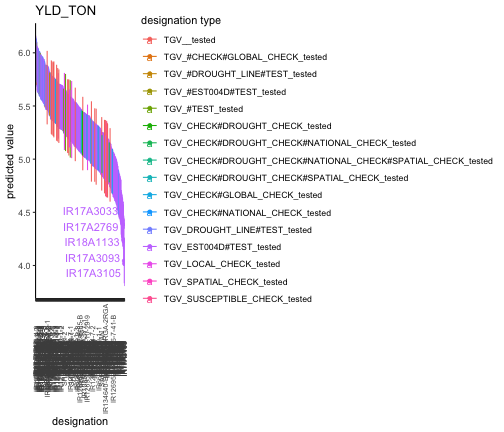

<!-- <style> -->
<!-- .main-container { -->
<!--   max-width: 200%; -->
<!--   margin-left: 0; -->
<!--   margin-right: 0; -->
<!-- } -->
<!-- .tab-content { -->
<!--   margin-bottom: 50px; -->
<!-- } -->
<!-- .book .book-body .page-inner { -->
<!--   max-width: 2000px; -->
<!-- } -->
<!-- </style> -->


<!-- ***   -->

<!-- ## Data Preview -->


***


&nbsp;  

## Phenotypic Correlation of STA BLUEs between trials  

  

###  HT_AVG   
  <div class="figure">

<p class="caption">plot of chunk corr_heatmap</p>
</div><div class="figure">

<p class="caption">plot of chunk corr_heatmap</p>
</div>

###  YLD_TON   
  <div class="figure">

<p class="caption">plot of chunk corr_heatmap</p>
</div><div class="figure">

<p class="caption">plot of chunk corr_heatmap</p>
</div>


## Predictions  


```
Error in path.expand(path): invalid 'path' argument
```

&nbsp;  

## Metrics

```
Error in path.expand(path): invalid 'path' argument
```

&nbsp;  


## Distribution of BLUPs {.tabset .tabset-pills}    

  

###  FLW50   


###  HT_AVG   
<div class="figure">

<p class="caption">plot of chunk values_dist</p>
</div>

&nbsp;  

###  YLD_TON   
<div class="figure">

<p class="caption">plot of chunk values_dist</p>
</div>

&nbsp;  

## {-}

<!-- &nbsp;   -->

***  

These results were generated using the latest version (July 2023) of the analytics R Shiny apps - [**bioflow**](https://cgiar-market-intelligence.shinyapps.io/bioflow) app from https://github.com/Breeding-Analytics. 


